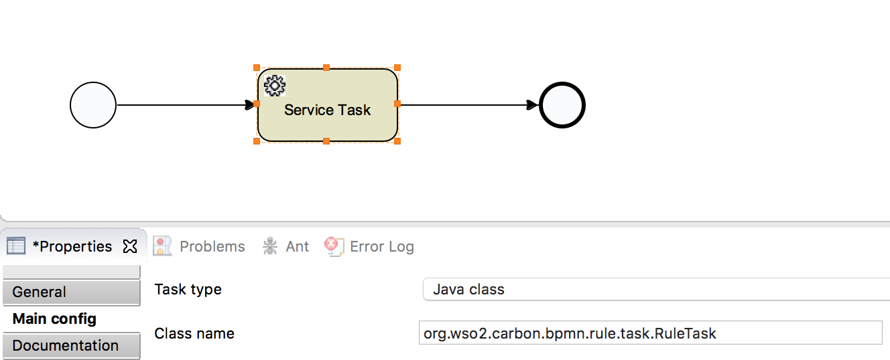
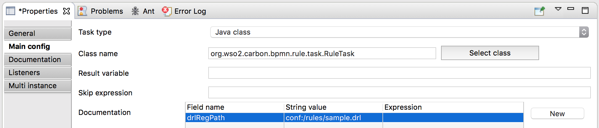
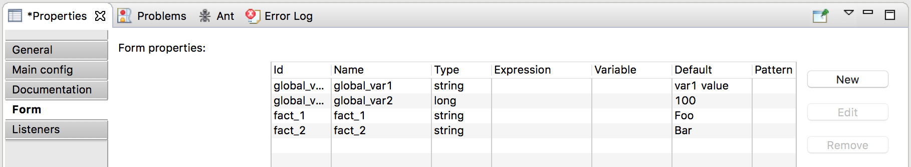

# WSO2 BPMN Rule Task

WSO2 BPMN Rule Task provides features for executing Drools rules in WSO2 Enterprise Integrator(EI)/BPS in BPMN process 
work flows. It has been implemented using a BPMN service task and the Drools files are designed to be managed in 
BPS registry.

## Getting Started

1. Clone this repository and build it using maven:

    ````bash
    git clone https://github.com/imesh/wso2-bpmn-rule-task.git
    mvn clean install
    ````

2. Copy the following JAR files to the lib/ directory of the WSO2 EI/BPS server:

    ````bash
    cp target/bpmn-rule-task-1.0-SNAPSHOT.jar ${WSO2_EI_HOME}/lib/
    cp target/dependency/drools-compiler-6.0.1.Final.jar ${WSO2_EI_HOME}/lib/
    cp target/dependency/drools-core-6.0.1.Final.jar ${WSO2_EI_HOME}/lib/
    cp target/dependency/kie-api-6.0.1.Final.jar ${WSO2_EI_HOME}/lib/
    cp target/dependency/kie-internal-6.0.1.Final.jar ${WSO2_EI_HOME}/lib/
    cp target/dependency/mvel2-2.1.8.Final.jar ${WSO2_EI_HOME}/lib/
    ````

3. Implement a BPMN process work flow using WSO2 Developer Studio and add a service task to it. Then click on the 
service task and add the following class name under main config:

    
    
    ````
    org.wso2.carbon.bpmn.rule.task.RuleTask
    ````

4. Upload a Drools rule file to WSO2 EI/BPS registry path ```/_system/config/rules/``` using the Carbon console:
 
    ````drools
    package com.sample
    
    global String var1;
    global Integer var2;
    
    rule "Rule 1"
        when
            value: Object (true)
        then
            System.out.println( "Fact: " + value);
            System.out.println( "var1: " + var1);
            System.out.println( "var2: " + var2);
    end
    ````
 
5. Provide its resource path using a documentation field in the above service task with the name drlRegPath as follows:

    
    
    ````
    drlRegPath = conf:/rules/sample.drl
    ````

5. Now define required global variables of the Drools rule file using the prefix ```global_``` and facts using 
```fact_``` as follows:

    
    
6. Generate the deployment artifact of the above BPMN process work flow and deploy it in WSO2 EI/BPS server.

7. Once deployed, invoke the process flow using the BPMN explorer.